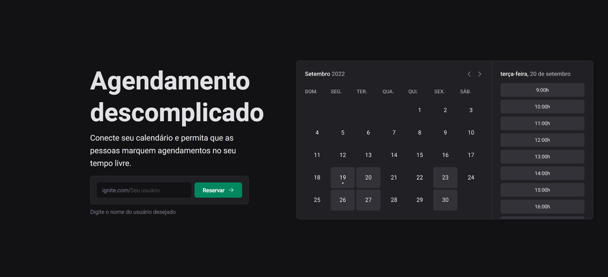
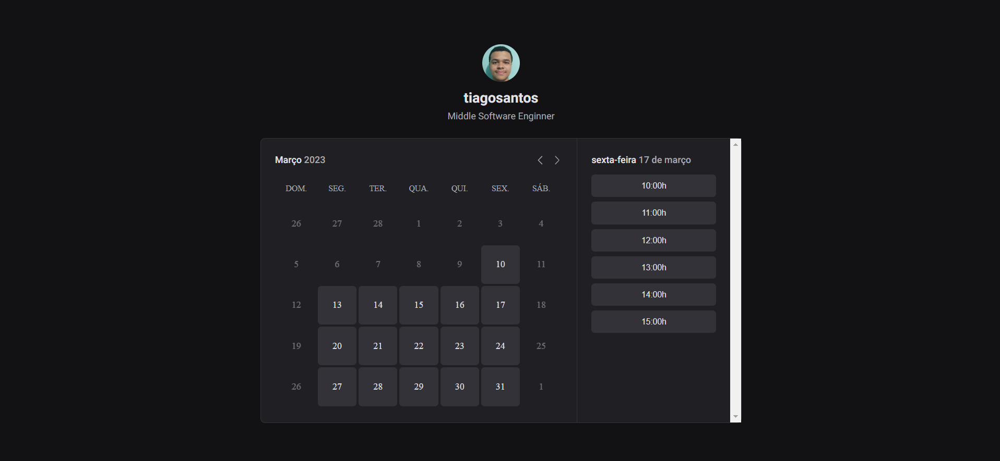

<h1 align="center">Ignite Call</h1>

<p align="center">
  
  
  <a href="https://github.com/jtiagosantos/ignite-call/commits/master">
    
  </a>
  
   <a href="https://github.com/jtiagosantos/ignite-call/stargazers">
    
  </a>
</p>

<h4 align="center"> 
  🚧 Ignite Call 🗓️ Completed 🚀 🚧
</h4>

<p align="center">
  <a href="#-features">Features</a> •
  <a href="#-run-project">Run Project</a> • 
  <a href="#-technologies">Technologies</a> • 
  <a href="#-author">Author</a> • 
  <a href="#-design">Design</a> • 
  <a href="#-license">License</a>
</p>

<br>

<h1 align="center">
  
</h1>

<h1 align="center">
  
</h1>


## ⚙️ Features

- [x] Create profile user
- [x] Connect account to Google Schedule
- [x] Select available days and time intervals
- [x] Choose a day and time to a call
- [x] Create event on Google Schedule

<br>

## 🚀 Run Project

1️⃣ Clone project and access its folder:

```bash
$ git clone https://github.com/jtiagosantos/ignite-call.git
$ cd ignite-call
```

2️⃣ Install dependencies:

```bash
$ npm i
```

3️⃣ Define environment variables:

```bash
DATABASE_URL=""

#Next Auth
NEXTAUTH_SECRET=""

# Google OAuth
GOOGLE_CLIENT_ID=""
GOOGLE_CLIENT_SECRET=""
```

4️⃣ Start project:

```bash
$ npm run dev
```

<br>


## 🛠 Technologies

The following tools were used in the construction of project:

- **[Next.js](https://nextjs.org/docs/getting-started)**
- **[Typescript](https://www.typescriptlang.org/)**
- **[NextAuth](https://next-auth.js.org/getting-started/introduction)**
- **[Prisma](https://www.prisma.io/docs)**
- **[Ignite UI](https://rocketseat-education.github.io/05-design-system/?path=/story/home--page)**
- **[Zod](https://github.com/colinhacks/zod)**
- **[React Hook Form](https://react-hook-form.com/)**
- **[Nookies](https://www.npmjs.com/package/nookies)**
- **[Next-SEO](https://github.com/garmeeh/next-seo)**
- **[Googleapis](https://www.npmjs.com/package/googleapis)**
- **[Dayjs](https://www.npmjs.com/package/dayjs)**
- **[Axios](https://axios-http.com/docs/intro)**

<br>

## 🔖 Layout

You can view the project layout through the link below:

- **[Layout Web](https://www.figma.com/file/ZemB70rNdfEUKby2zhVX3y/Ignite-Call-(Community)?node-id=0%3A1&t=Pz3bCKkQRKaQ01sg-0)**

<br>

## 👨‍💻 Author


<strong><a href="https://github.com/jtiagosantos">Tiago Santos </a>🚀</strong>

[](https://www.linkedin.com/in/josetiagosantosdelima/)
[](mailto:tiago.santos@icomp.ufam.edu.br)

<br>

## 📝 License

This project is under license [MIT](./LICENSE).
